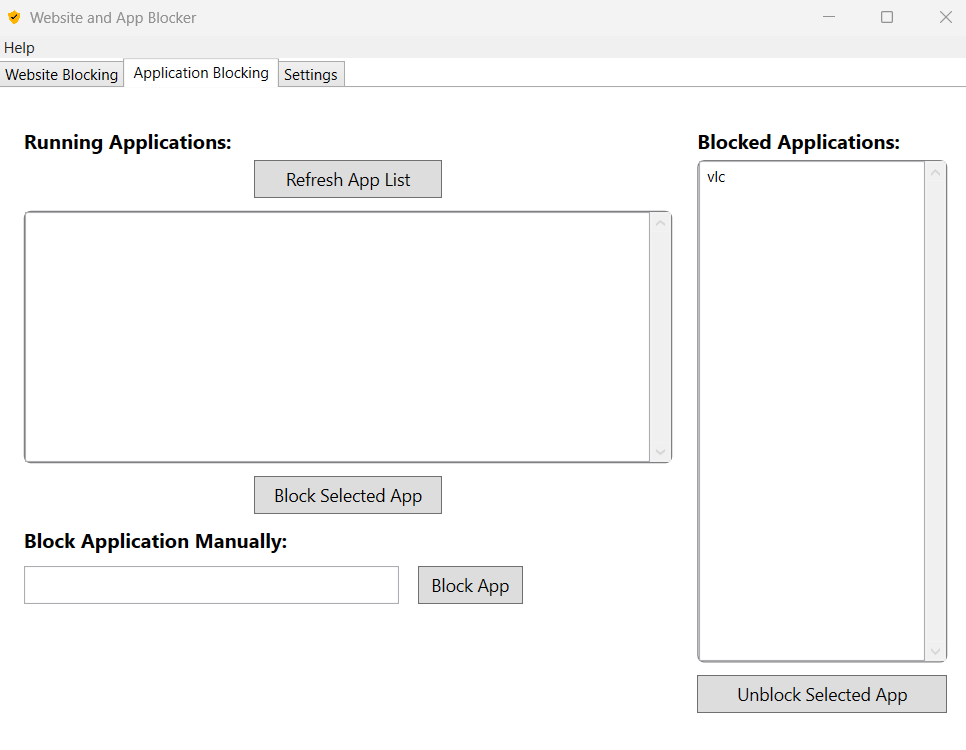
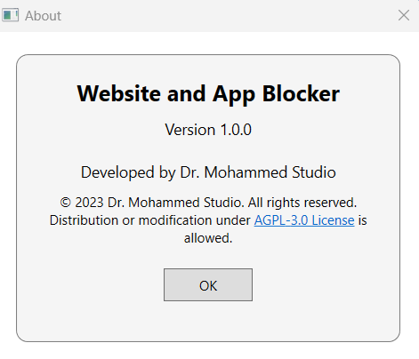

# Website and App Blocker

[](https://github.com/MohammedTsmu/WebsiteAndAppBlocker/blob/master/LICENSE.txt)
[](https://github.com/MohammedTsmu/WebsiteAndAppBlocker/issues)
[](https://github.com/MohammedTsmu/WebsiteAndAppBlocker/stargazers)

## Overview

**Website and App Blocker** is an open-source application designed to help users manage and restrict access to specific websites and applications during designated study hours. This tool is ideal for students and professionals seeking to enhance productivity by minimizing distractions.

## Features

- **Block Websites:** Prevent access to distracting websites by modifying the system's hosts file.
- **Block Applications:** Automatically terminate specified applications during study periods.
- **Scheduling:** Define blocking periods (e.g., 4 AM to 10 PM) to enforce focus times.
- **Authentication:** Secure access to settings and unblocking features with password protection.
- **System Tray Integration:** Minimize the application to the system tray for unobtrusive operation.
- **Challenge Verification:** Ensure intentional unblocking actions through challenge prompts.
- **User-Friendly Interface:** Easy-to-navigate UI for managing blocked items and settings.

## Screenshots


*Main interface for managing blocked websites and applications block list. 👆*



*App block section.👆*



*Information about the application.👆*


## Installation

1. **Download the Latest Release:**
   - Visit the [Releases](https://github.com/MohammedTsmu/WebsiteAndAppBlocker/releases) page.
   - Download the installer version.

2. **Run the Installer:**
   - Execute the downloaded installer and follow the on-screen instructions.
   - Ensure you have administrative privileges as the application modifies system files.

3. **Launch the Application:**
   - After installation, launch **Website and App Blocker** from the Start Menu or Desktop shortcut.

## Usage

1. **Initial Setup:**
   - On the first run, you'll be prompted to log in. Since no password is set initially, simply click **Login** to access the main window.

2. **Setting a Password:**
   - Navigate to the **Settings** tab.
   - Enter a new password and confirm it.
   - Click **Set Password** to secure the application.

3. **Blocking Websites:**
   - In the **Websites** section, enter the URL of the website you wish to block in this structure (example.com).
   - Click **Block Website** to add it to the blocked list.

4. **Blocking Applications:**
   - In the **Applications** section, select from the app list after refresh it or enter the name of the application executable (e.g., `chrome.exe`).
   - Click **Block Application** to add it to the blocked list.

5. **Unblocking Items:**
   - To unblock a website or application, select it from the blocked list and click the **Unblock** button.
   - You'll be prompted to authenticate and complete a challenge before the item is unblocked.
   - This secures the challenge of modifying students' poor behaviors by helping them forget about distracting websites.

6. **System Tray Operations:**
   - Minimize the application to the system tray.
   - Right-click the tray icon to access options like **Open** or **Exit**.
   - The app will refuse to close duing study time, anti-cheating will prevent student to close app duing study time (4AM - 10PM).

## Contributing

Contributions are welcome! If you'd like to improve **Website and App Blocker**, please follow these steps:

1. **Fork the Repository:**
   - Click the **Fork** button at the top-right corner of the repository page.

2. **Clone the Forked Repository:**
   ```bash
   git clone https://github.com/MohammedTsmu/WebsiteAndAppBlocker.git
   

License
© 2023 Dr. Mohammed Studio. All rights reserved.
Distribution or modification under the AGPL-3.0 License is allowed.
